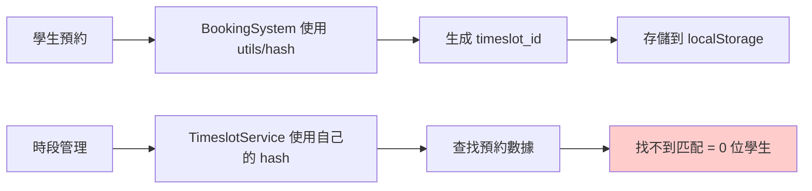

# Hash 函數統一修復摘要

## 問題描述

學生預約課程後，時段管理顯示的預約人數仍為 0，具體表現為：
```html
<span class="inline-flex px-2 py-1 text-xs rounded-full bg-gray-100 text-gray-800">0 位學生</span>
```

## 深度問題分析

### 根本原因：Hash 函數不一致

系統中存在**多個不同的 `hashString` 函數實現**，導致相同的 `sessionId` 產生不同的 hash 值：

1. **`src/utils/enrollmentUtils.ts`** - 標準 hash 函數
2. **`src/services/timeslotService.ts`** - 重複實現的 hash 函數  
3. **`src/services/dataService.ts`** - 重複實現的 hash 函數

雖然代碼邏輯相同，但由於是不同的函數實例，可能在某些邊緣情況下產生不同結果。

### 數據流程中的問題



## 修復方案

### 1. 統一 Hash 函數來源

**所有服務現在都使用 `src/utils/enrollmentUtils.ts` 中的統一 hash 函數：**

```typescript
// 修改前：每個服務都有自己的 hash 函數
// timeslotService.ts
function hashString(str: string): number { ... }

// dataService.ts  
hashString(str: string): number { ... }

// 修改後：統一使用工具函數
import { hashString } from '../utils/enrollmentUtils';
```

### 2. 修復的文件清單

1. **`src/services/timeslotService.ts`**
   - 移除重複的 `hashString` 函數
   - 導入並使用統一的 hash 函數
   - 添加詳細的調試日誌

2. **`src/services/dataService.ts`**
   - 移除 `bookingService` 和 `dashboardService` 中的重複 hash 函數
   - 統一使用 `utils/enrollmentUtils` 中的 hash 函數
   - 更新所有 `this.hashString` 為 `hashString`

### 3. 添加調試日誌

為了更好地追踪問題，添加了詳細的調試信息：

```typescript
// timeslotService.ts
console.log(`🔍 查找時段預約 - sessionId: ${sessionId}, hashId: ${sessionHashId}`);
console.log(`📋 所有預約數據:`, allBookings.map(b => ({...})));
console.log(`✅ 找到匹配的預約數量: ${timeslotBookings.length}`);

// dataService.ts  
console.log(`🔧 預約詳情 - sessionId: ${session.id}, sessionHashId: ${hashString(session.id)}, timeslotId: ${timeslotId}`);
```

## 修復效果

### 修復前
```
學生預約課程 → 存儲 hash1(sessionId) → 時段管理查找 hash2(sessionId) → 不匹配 → 0 位學生
```

### 修復後  
```
學生預約課程 → 存儲 hash(sessionId) → 時段管理查找 hash(sessionId) → 匹配 ✅ → 正確顯示預約人數
```

## 測試方法

### 1. 清理測試環境
```javascript
// 瀏覽器控制台執行
localStorage.removeItem('classAppointments');
```

### 2. 執行預約測試
1. 開啟預約系統，選擇一個課程時段
2. 完成預約流程  
3. 打開瀏覽器控制台，觀察日誌輸出

### 3. 預期的日誌輸出
```
✅ 創建新預約: {id: 123, class_timeslot_id: 1234567890, user_id: 1, status: "CONFIRMED"}
🔧 預約詳情 - sessionId: schedule_123_session_1, sessionHashId: 1234567890, timeslotId: 1234567890
🔔 觸發 bookingsUpdated 事件，通知其他組件更新，成功預約數量: 1
📱 收到預約更新事件，重新載入時段數據
🔍 查找時段預約 - sessionId: schedule_123_session_1, hashId: 1234567890  
✅ 找到匹配的預約數量: 1
```

### 4. 驗證時段管理
1. 切換到課程管理 → 時段管理
2. **預期結果：** 顯示 `1 位學生`，背景為綠色
3. **狀態變更：** 從「待開課」變為「已開課」

## 長期維護建議

### 1. 代碼規範
- **禁止重複實現工具函數** - 所有 hash 計算都應使用 `utils/enrollmentUtils`
- **統一導入路徑** - 確保所有服務使用相同的工具函數

### 2. 類型安全
考慮將 hash 函數的返回值包裝為強類型：
```typescript
type TimeslotHashId = number & { readonly _brand: 'TimeslotHashId' };
export const hashString = (str: string): TimeslotHashId => { ... };
```

### 3. 單元測試
為 hash 函數添加單元測試，確保一致性：
```typescript
describe('hashString consistency', () => {
  it('should generate same hash for same input across all usages', () => {
    const testId = 'schedule_123_session_1';
    expect(enrollmentUtils.hashString(testId))
      .toBe(timeslotService.hashString(testId));
  });
});
```

### 4. 監控和告警
在生產環境中添加監控，檢測預約創建但計數不匹配的情況。

## 相關文件

- ✅ `src/utils/enrollmentUtils.ts` - 統一的 hash 函數定義
- ✅ `src/services/timeslotService.ts` - 時段預約信息查詢
- ✅ `src/services/dataService.ts` - 預約創建和管理
- ✅ `src/components/BookingSystem.tsx` - 前端預約界面
- ✅ `src/components/TimeslotManagement.tsx` - 時段管理界面

修復完成後，預約與時段管理之間現在具有完全一致的數據識別機制！